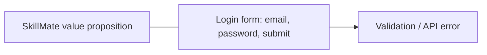
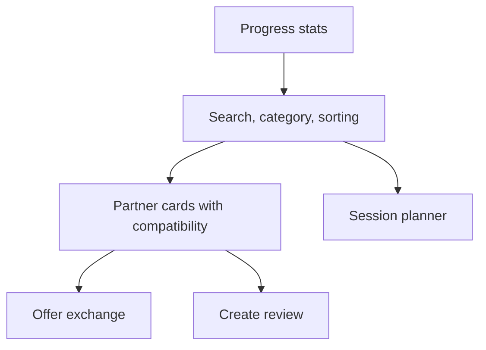
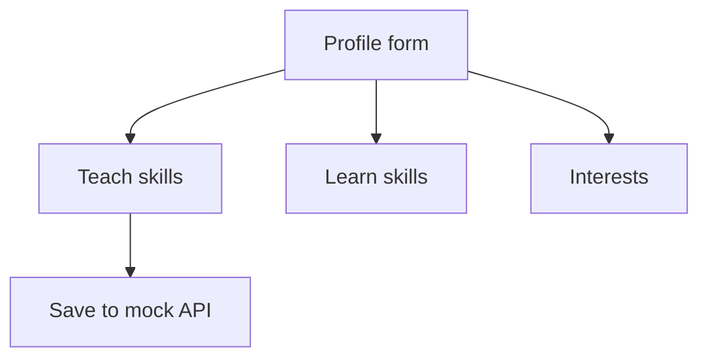
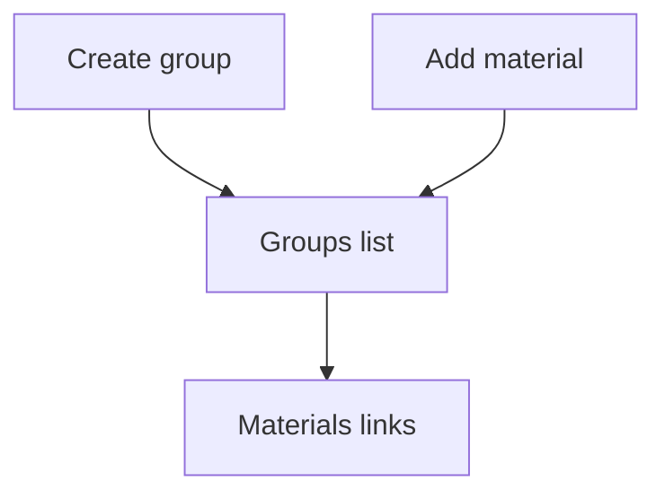

# Локальный UX-прототип

Этот файл заменяет внешний Figma/Unidraw/Miro для репозитория. Перед сдачей можно перенести эти экраны в Figma и заменить ссылку в `docs/ux.md`.

## Экран 1: Login

Состояние входа показывает короткое описание продукта и форму авторизации.

## Экран 2: Dashboard

Главный экран после входа: прогресс, поиск, фильтры, список партнёров и форма планирования сессии.

## Экран 3: Profile

Форма редактирования профиля с навыками, целями и интересами.

## Экран 4: Groups

Создание групп и добавление материалов.

